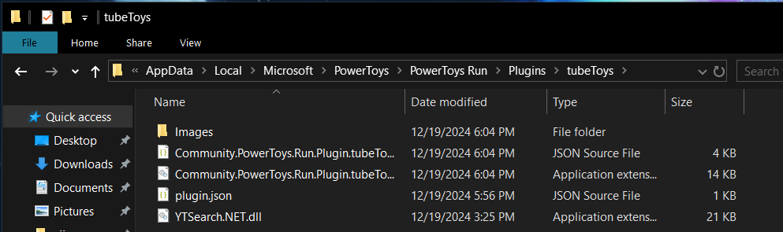

# tubeToys
A PowerToys plugin to directly search on youtube.

## Installation
1. Download the latest release from the [releases page](https://github.com/vijayv996/tubeToys/releases).
2. Extract the `.zip` file's contents to `%LocalAppData%\Microsoft\PowerToys\PowerToys Run\Plugins`
##### Structure

3. Restart PowerToys.

## Usage & screenshots
- Open PowerToys Run.
- Type `yt` and enter the search term.

- Hit enter immediately to search the term in your default browser.

- Else wait for the results to load.

- Select the result and hit enter to open the video in your default browser

## Credits
- [UnidentifiedX](https://github.com/UnidentifiedX/YTSearch.NET).
- [8LWXpg](https://github.com/8LWXpg) for this amazing [template](https://github.com/8LWXpg/PowerToysRun-PluginTemplate).
- [websearch](https://github.com/microsoft/PowerToys/tree/main/src/modules/launcher/Plugins/Community.PowerToys.Run.Plugin.WebSearch).
- [hlaueriksson blog](https://conductofcode.io/post/creating-custom-powertoys-run-plugins/).
- [FastWeb](https://github.com/CCcat8059/FastWeb).